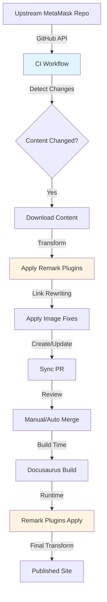

# Port MetaMask Services Content with Hybrid Sync System

## Overview

Extend the existing remark/rehype plugin tooling from `/Users/harriebickle/GitHub/delete-rocking/Rocking-here/Rocking/porting-data/test-duplicate-data` to `/Users/harriebickle/GitHub/Consensys/docs-template`. Implement a hybrid approach combining:
1. **Runtime plugins** - Transform content at build time using remark/rehype
2. **CI sync PRs** - Automated PRs for explicit, reviewable upstream changes

Port specific content:
- **File**: `https://docs.metamask.io/services/` (services index page)
- **Folder**: `https://docs.metamask.io/services/reference/base/json-rpc-methods/` (Base JSON-RPC methods)

## Architecture

### Data Flow



### Components

1. **Remark/Rehype Plugins** (Runtime, build-time)
   - `remark-link-rewriter` - Rewrites links based on YAML config
   - `remark-fix-image-paths` - Fixes image paths for Docusaurus
   - Extended to handle MetaMask-specific patterns

2. **CI Sync Workflow** (GitHub Actions)
   - Watches upstream repo every 24h at noon UTC
   - Detects changes in specified paths
   - Downloads and transforms content
   - Creates/updates PRs with transformed content

3. **Configuration** (YAML)
   - `link-replacements.yaml` - Link rewriting rules
   - Supports exact replacements and pattern-based replacements
   - Handles full MetaMask paths (e.g., `/services/reference/sei/`)

## Implementation Tasks

### 1. Port Existing Plugins to docs-template

**Files to create:**
- `plugins/remark-link-rewriter.js` - Copy and adapt from test-duplicate-data
- `plugins/remark-fix-image-paths.js` - Copy and adapt from test-duplicate-data
- `link-replacements.yaml` - Configuration for link rewriting

**Changes needed:**
- Update paths to work with docs-template structure
- Add support for preserving full MetaMask paths (e.g., `/services/reference/sei/` → `https://docs.metamask.io/services/reference/sei/`)
- Ensure compatibility with docs-template's Docusaurus config

### 2. Configure Docusaurus to Use Plugins

**File:** `docusaurus.config.js`

Add remark plugins to the docs configuration:
```javascript
remarkPlugins: [
  require('./plugins/remark-link-rewriter'),
  require('./plugins/remark-fix-image-paths'),
],
```

### 3. Create CI Sync Workflow

**File:** `.github/workflows/sync-metamask-content.yml`

**Features:**
- Scheduled: Runs daily at noon UTC
- Detects changes in upstream MetaMask repo
- Downloads specified content:
  - `services/index.md` (or equivalent)
  - `services/reference/base/json-rpc-methods/**`
- Applies transformations using the same plugins
- Creates/updates PR with transformed content
- PR title format: `chore: sync MetaMask services content [date]`
- PR body includes:
  - List of changed files
  - Link to upstream commit
  - Diff preview

**Implementation details:**
- Use `@octokit/rest` (already in dependencies)
- Use `docusaurus-plugin-remote-content` or direct GitHub API
- Apply transformations before committing
- Handle conflicts gracefully

### 4. Create Sync Script

**File:** `scripts/sync-metamask-content.js`

**Functions:**
- `detectUpstreamChanges()` - Check for new commits in upstream
- `downloadContent()` - Download specified files/folders
- `applyTransformations()` - Run remark plugins on content
- `createSyncPR()` - Create or update PR with changes
- `handleImages()` - Download and place images in `static/img/`

**Reuse logic from:** `test-duplicate-data/scripts/get-remote.js`

### 5. Add Test Coverage

**Files to create:**
- `plugins/__tests__/remark-link-rewriter.test.js`
- `plugins/__tests__/remark-fix-image-paths.test.js`

**Test framework:** Jest (common for Node.js projects)

**Test cases:**
- Link rewriting with exact matches
- Link rewriting with pattern matches
- Path extraction for pattern-based replacements
- Image path fixes (various patterns)
- Handling of external URLs
- Handling of anchor links
- Edge cases (empty config, malformed YAML, etc.)

### 6. Update link-replacements.yaml

**File:** `link-replacements.yaml`

Add rules for:
- Services index page links
- Base JSON-RPC methods links
- Full MetaMask path preservation (e.g., `/services/reference/sei/` → `https://docs.metamask.io/services/reference/sei/`)
- Other common MetaMask link patterns

### 7. Document the System

**File:** `docs/single-source/between-repos/port-data.md`

**Content:**
- Overview of the hybrid approach
- How to configure link replacements
- How CI sync PRs work
- How to review and revert sync PRs
- How to manually trigger sync
- Troubleshooting guide

### 8. Initial Content Port

**Manual step (or first CI run):**
- Port `services/index.md` to appropriate location in docs-template
- Port `services/reference/base/json-rpc-methods/` folder
- Ensure images are downloaded and placed correctly
- Verify link rewriting works
- Test build

## Configuration Example

**link-replacements.yaml:**
```yaml
replacements:
  /services: https://docs.metamask.io/services
  /services/reference/base: /reference/base

patterns:
  # Preserve full MetaMask paths for certain references
  - pattern: '/services/reference/sei/.+'
    replacement: 'https://docs.metamask.io/services/reference/sei'
    extractPath: true
    description: 'Preserve full MetaMask path for Sei references'
  
  # Rewrite Base JSON-RPC links
  - pattern: '/services/reference/base/.+'
    replacement: '/reference/base'
    extractPath: true
    description: 'Rewrite Base reference links to local paths'
```

## Dependencies

**Already in docs-template:**
- `@octokit/rest` - For GitHub API
- `js-yaml` - Need to add for YAML parsing
- `unist-util-visit` - May need for advanced AST traversal (optional)

**To add:**
- `js-yaml` - For parsing link-replacements.yaml
- `jest` - For testing (dev dependency)

## Files to Modify/Create

### New Files
- `plugins/remark-link-rewriter.js`
- `plugins/remark-fix-image-paths.js`
- `link-replacements.yaml`
- `scripts/sync-metamask-content.js`
- `.github/workflows/sync-metamask-content.yml`
- `plugins/__tests__/remark-link-rewriter.test.js`
- `plugins/__tests__/remark-fix-image-paths.test.js`
- `docs/single-source/between-repos/port-data.md` (update existing empty file)

### Modified Files
- `docusaurus.config.js` - Add remark plugins
- `package.json` - Add dependencies and test script

## Success Criteria

1. ✅ Plugins successfully ported and working in docs-template
2. ✅ CI workflow creates PRs for upstream changes
3. ✅ Link rewriting preserves full MetaMask paths where needed
4. ✅ Images are correctly downloaded and referenced
5. ✅ Test coverage for plugins exists
6. ✅ Documentation explains the system
7. ✅ Initial content ported successfully
8. ✅ Build succeeds with ported content

## Notes

- The hybrid approach allows for both automatic updates (via CI) and runtime flexibility (via plugins)
- PRs remain in history even after merge, allowing reverts if needed
- The system is designed to be extensible for additional content sources
- Link rewriting rules are centralized in YAML for easy maintenance

## Task Checklist

- [ ] Port remark-link-rewriter.js and remark-fix-image-paths.js plugins from test-duplicate-data to docs-template, adapting paths and adding support for full MetaMask path preservation
- [ ] Create link-replacements.yaml with rules for services index, Base JSON-RPC methods, and full MetaMask path preservation patterns
- [ ] Update docusaurus.config.js to use the remark plugins in the docs configuration
- [ ] Create scripts/sync-metamask-content.js with functions to detect upstream changes, download content, apply transformations, and create sync PRs
- [ ] Create .github/workflows/sync-metamask-content.yml that runs daily, detects changes, and creates/updates PRs with transformed content
- [ ] Create test files for remark-link-rewriter and remark-fix-image-paths plugins with comprehensive test cases
- [ ] Update docs/single-source/between-repos/port-data.md with comprehensive documentation of the hybrid system, configuration, and workflows
- [ ] Add js-yaml dependency and jest for testing, add test script to package.json
- [ ] Manually port services/index.md and services/reference/base/json-rpc-methods/ folder, verify link rewriting and image handling work correctly

